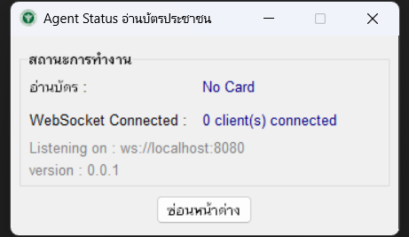

# Akathospital Thai Card Agent 🏥💳

**Akathospital Thai Card Agent** คือโปรแกรมสำหรับเครื่องคอมพิวเตอร์ (Desktop Application) ที่ทำหน้าที่เป็นตัวกลางในการอ่านข้อมูลจากบัตรประจำตัวประชาชนไทยแบบอเนกประสงค์ (Smart Card) เพื่อส่งต่อไปยังระบบงานของโรงพยาบาลหรือเว็บแอปพลิเคชันต่างๆ ได้อย่างสะดวกและปลอดภัย

 

  
   
  <em>(ภาพตัวอย่างจากโปรเจกต์ต้นฉบับ)</em>

 

## ✨ คุณสมบัติเด่น (Features)

* ✅ **อ่านข้อมูลครบถ้วน**: อ่านข้อมูลทั่วไปและรูปภาพจากหน้าบัตรประชาชน Smart Card
* ⏰ **ทำงานแบบ Real-time**: อ่านข้อมูลและส่งต่อไปยังโปรแกรมเป้าหมายทันทีที่ผู้ใช้สั่งการ
* 🔒 **เน้นความเป็นส่วนตัวสูงสุด**: ไม่มีการจัดเก็บหรือส่งข้อมูลส่วนบุคคลจากบัตรไปยังเซิร์ฟเวอร์ของผู้พัฒนาโดยเด็ดขาด
* 🔌 **เชื่อมต่อง่าย**: ทำงานในรูปแบบ WebSocket Server เพื่อให้เว็บแอปพลิเคชันสามารถเชื่อมต่อและรับข้อมูลได้อย่างง่ายดาย
* 🖥️ **มีหน้าจอผู้ใช้งาน (GUI)**: ใช้งานง่ายผ่านโปรแกรมบนเดสก์ท็อป

---

## ⚙️ หลักการทำงาน (How it Works)

โปรแกรมจะทำหน้าที่เป็นสะพานเชื่อมระหว่างเครื่องอ่านบัตรกับโปรแกรมของโรงพยาบาล (HIS) หรือหน้าเว็บที่ต้องการใช้ข้อมูล โดยมีลำดับการทำงานดังนี้:

**[เครื่องอ่านบัตร Smart Card]** ➡️ **[โปรแกรม Thai Card Agent]** ➡️ **[โปรแกรมโรงพยาบาล / เว็บแอปพลิเคชัน]**

เมื่อผู้ใช้เสียบบัตรและกดปุ่มในโปรแกรม Agent ข้อมูลจะถูกอ่านและส่งออกไปทันทีผ่าน WebSocket ไปยังโปรแกรมปลายทางที่รอรับอยู่

---

## 🚀 การติดตั้งและใช้งาน (Getting Started)

### สิ่งที่ต้องมี (Prerequisites)

1.  ระบบปฏิบัติการ Windows
2.  เครื่องอ่านบัตร Smart Card ที่ติดตั้งไดรเวอร์เรียบร้อยแล้ว
3.  บัตรประจำตัวประชาชน Smart Card

### ขั้นตอนการติดตั้ง (Installation)

1.  ดาวน์โหลดโปรแกรมเวอร์ชันล่าสุดจากหน้า [Releases](https://github.com/DoNuTll40/akat-card-agent-demo/releases/tag)
2.  แตกไฟล์ .zip (หากมี)
3.  เปิดโปรแกรม `AkathospitalThaiCardAgent.exe` เพื่อเริ่มการติดตั้งและปฏิบัติตามขั้นตอนบนหน้าจอ

### การใช้งาน (Usage)

1.  เชื่อมต่อเครื่องอ่านบัตรเข้ากับคอมพิวเตอร์
2.  เปิดโปรแกรม "Akathospital Thai Card Agent"
3.  เมื่อโปรแกรมทำงานและอยู่ในสถานะ "พร้อมใช้งาน" ให้เสียบบัตรประชาชน
4.  กดปุ่ม "อ่านข้อมูล" ในโปรแกรม เพื่อส่งข้อมูลไปยังระบบปลายทางที่ตั้งค่าไว้

---

## 📜 ข้อตกลงและเงื่อนไขการใช้งาน (EULA)

การติดตั้งหรือใช้งานโปรแกรม **Akathospital Thai Card Agent** ถือว่าท่านได้อ่าน, ทำความเข้าใจ, และยอมรับข้อตกลงและเงื่อนไขทั้งหมดในเอกสารฉบับนี้

<strong>คลิกเพื่ออ่านข้อตกลงฉบับเต็ม (Click to expand)</strong>

============================================================
 
**โปรแกรม:** Akathospital Thai Card Agent
 
**เวอร์ชัน:** 0.0.1
 
**วันที่:** 16 มิถุนายน 2568
 
**ผู้พัฒนา:** Akathospital
 
-------------------------------------------------------------------
 

โปรดอ่านข้อตกลงและเงื่อนไขต่อไปนี้อย่างละเอียดก่อนทำการติดตั้งโปรแกรม "Akathospital Thai Card Agent" การติดตั้งหรือใช้งานโปรแกรมนี้ถือว่าท่านได้ยอมรับข้อตกลงทั้งหมดที่ระบุไว้ด้านล่างนี้

### 1. คำอธิบายโปรแกรม (SOFTWARE DESCRIPTION)

โปรแกรม Akathospital Thai Card Agent ("ซอฟต์แวร์") ถูกพัฒนาขึ้นเพื่อใช้เป็นเครื่องมือในการอ่านข้อมูลจากบัตรประจำตัวประชาชนแบบอเนกประสงค์ (Smart Card) เพื่ออำนวยความสะดวกในการนำข้อมูลไปใช้ในระบบงานบริการของโรงพยาบาลหรือหน่วยงานที่เกี่ยวข้อง

### 2. การอนุญาตให้ใช้งาน (GRANT OF LICENSE)

ผู้พัฒนาอนุญาตให้ท่านติดตั้งและใช้งานซอฟต์แวร์นี้ได้โดยไม่มีค่าใช้จ่าย สำหรับการใช้งานภายในองค์กรตามวัตถุประสงค์ที่ได้ระบุไว้

### 3. ข้อจำกัดการใช้งาน (RESTRICTIONS)

ท่านไม่สามารถกระทำการดังต่อไปนี้โดยไม่ได้รับอนุญาตเป็นลายลักษณ์อักษรจากผู้พัฒนา:
- ทำการคัดลอก, ดัดแปลง, แก้ไข, หรือทำวิศวกรรมย้อนกลับ (Reverse Engineering) ซอฟต์แวร์นี้
- ให้เช่า, ขาย, หรือจัดจำหน่ายซอฟต์แวร์นี้เพื่อผลประโยชน์ทางการค้า
- นำซอฟต์แวร์นี้ไปใช้ในทางที่ผิดกฎหมายหรือละเมิดสิทธิ์ของผู้อื่น

### 4. นโยบายความเป็นส่วนตัวและการจัดการข้อมูล (PRIVACY AND DATA HANDLING)

นี่คือข้อตกลงที่สำคัญที่สุด:
- ซอฟต์แวร์นี้ **ไม่ได้จัดเก็บหรือส่งข้อมูลส่วนบุคคล** จากบัตรประชาชนของผู้รับบริการไปยังเซิร์ฟเวอร์หรือฐานข้อมูลใดๆ ของผู้พัฒนาทั้งสิ้น
- การทำงานของโปรแกรมเป็นแบบ Real-time คืออ่านข้อมูลเพื่อแสดงผลหรือส่งต่อไปยังโปรแกรมอื่น (เช่น โปรแกรมของโรงพยาบาล หรือหน้าเว็บที่เปิดรอรับ) ตามที่ผู้ใช้งานสั่งเท่านั้น
- ความปลอดภัยของข้อมูลที่อ่านได้หลังจากถูกส่งต่อไปยังโปรแกรมอื่นจะอยู่ภายใต้นโยบายของโปรแกรมปลายทางนั้นๆ

### 5. การปฏิเสธการรับประกัน (DISCLAIMER OF WARRANTY)

ซอฟต์แวร์นี้ถูกจัดทำขึ้น "ตามสภาพที่เป็นอยู่" (AS IS) โดยไม่มีการรับประกันใดๆ ไม่ว่าโดยชัดแจ้งหรือโดยนัย ผู้พัฒนาไม่รับประกันว่าซอฟต์แวร์จะทำงานได้โดยไม่หยุดชะงัก, ปราศจากข้อผิดพลาด, หรือตรงตามความต้องการของท่านทุกประการ

### 6. ข้อจำกัดความรับผิด (LIMITATION OF LIABILITY)

ผู้พัฒนาจะไม่รับผิดชอบต่อความเสียหายใดๆ (รวมถึงแต่ไม่จำกัดเพียง ความเสียหายต่อข้อมูล, การสูญเสียผลประโยชน์ทางธุรกิจ, หรือความเสียหายอื่นๆ) ที่เกิดจากการใช้งานหรือการไม่สามารถใช้งานซอฟต์แวร์นี้ได้

### 7. ลิขสิทธิ์ (COPYRIGHT)

ซอฟต์แวร์นี้ประกอบด้วยส่วนประกอบที่เป็นทรัพย์สินทางปัญญาของผู้พัฒนาและส่วนประกอบโอเพนซอร์สตามที่ระบุไว้ในส่วนการให้เครดิต

---

## 🙏 ขอขอบคุณเป็นพิเศษ (Special Thanks & Credits)

> ส่วนของโปรแกรมอ่านข้อมูลจากบัตรประชาชน ได้รับการพัฒนาต่อยอดมาจากโปรเจกต์ **"lab-python3-th-idcard"** โดยคุณ Precha S. (Copyright (c) 2017 Precha S.) ซึ่งเผยแพร่ภายใต้ใบอนุญาตแบบ MIT License
>
> - **โปรเจกต์ต้นฉบับ**: [https://github.com/pstudiodev1/lab-python3-th-idcard](https://github.com/pstudiodev1/lab-python3-th-idcard)

> ส่วนของ WebSocket Server และส่วนติดต่อผู้ใช้ (GUI) ได้รับคำแนะนำและโค้ดตัวอย่างในการพัฒนาร่วมกับ **Gemini** ซึ่งเป็นแบบจำลองภาษาขนาดใหญ่ที่ฝึกฝนโดย Google

---

## 👨‍💻 ผู้พัฒนา

**Akathospital**